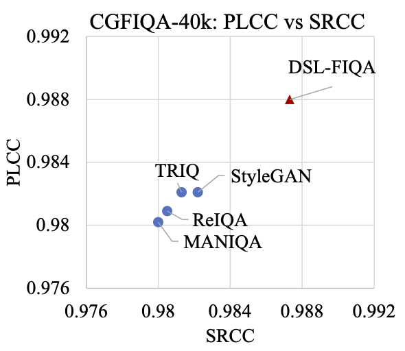
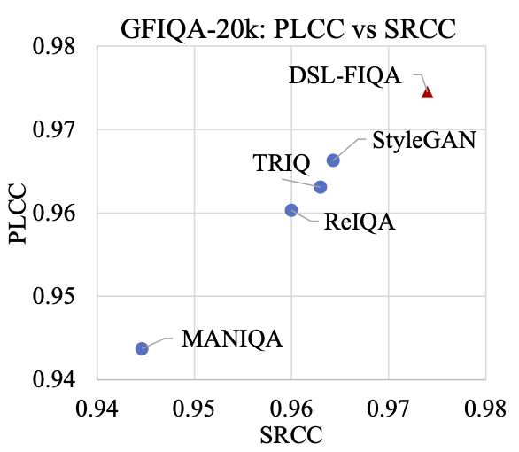
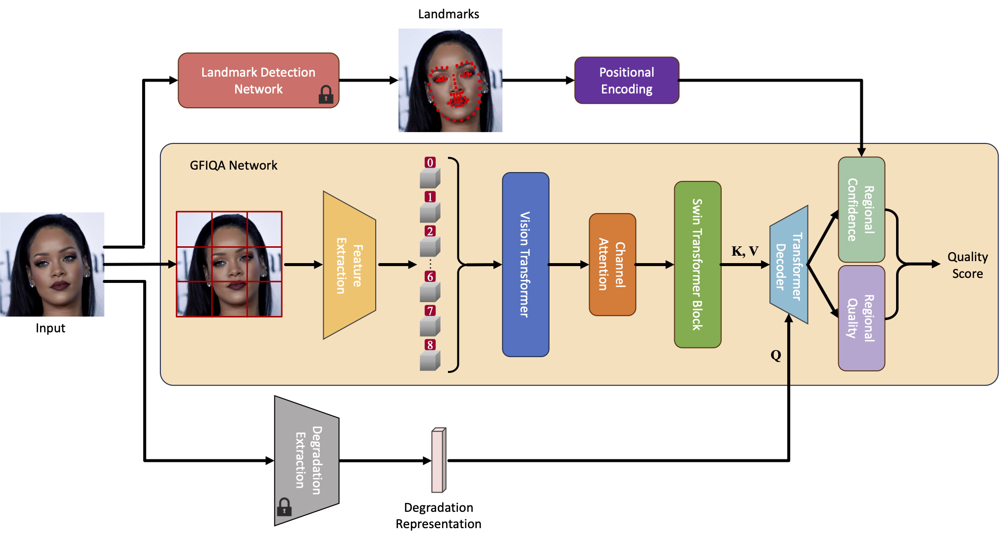
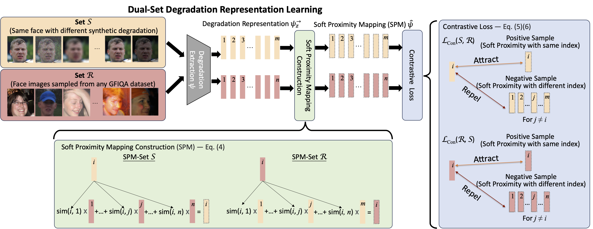

# DSL-FIQA
Official repository for DSL-FIQA: Assessing Facial Image Quality via Dual-Set Degradation Learning and Landmark-Guided Transformer (CVPR 2024)

(The code will be released soon.)

[Project Page](https://dsl-fiqa.github.io/) | [Paper](https://openaccess.thecvf.com/content/CVPR2024/papers/Chen_DSL-FIQA_Assessing_Facial_Image_Quality_via_Dual-Set_Degradation_Learning_and_CVPR_2024_paper.pdf) | [Arxiv](https://arxiv.org/abs/2406.09622) | [Video](https://www.youtube.com/watch?v=7jDzj-CBvbQ) | [Dataset](https://drive.google.com/drive/folders/1Fw8Yeoqrgqz3YlALWecpqP8vKZYuHPJl?usp=drive_link)

## Updates
- July 2024: ✨ CGFIQA-40k dataset has been released!
- Feb 2024: ✨ DSL-FIQA was accepted into CVPR 2024!


## Abstract
Generic Face Image Quality Assessment (GFIQA) evaluates the perceptual quality of facial images, which is crucial in improving image restoration algorithms and selecting high-quality face images for downstream tasks. We present a novel transformer-based method for GFIQA, which is aided by two unique mechanisms. First, a novel Dual-Set Degradation Representation Learning (DSL) mechanism uses facial images with both synthetic and real degradations to decouple degradation from content, ensuring generalizability to real-world scenarios. This self-supervised method learns degradation features on a global scale, providing a robust alternative to conventional methods that use local patch information in degradation learning. Second, our transformer leverages facial landmarks to emphasize visually salient parts of a face image in evaluating its perceptual quality. We also introduce a balanced and diverse Comprehensive Generic Face IQA (CGFIQA-40k) dataset of 40K images carefully designed to overcome the biases, in particular the imbalances in skin tone and gender representation, in existing datasets. Extensive analysis and evaluation demonstrate the robustness of our method, marking a significant improvement over prior methods.

<p align="center">
  
  
</p>


## Architecture of DSL-FIQA
The model contains a core GFIQA network, a degradation extraction network, and a landmark detection network. In our approach, face images are cropped into several patches to fit the input size requirements of the pre-trained ViT feature extractor. Each patch is then processed individually, and their Mean Opinion Scores (MOS) are averaged to determine the final quality score.



## Dual-Set Degradation Representation Learning (DSL)
On the left, the process of contrastive optimization is depicted, utilizing two unique image sets. Degradation representations are extracted, followed by soft proximity mapping (SPM) calculations and contrastive optimization, compelling the degradation encoder to focus on learning specific degradation features. The right side emphasizes the bidirectional characteristic of our approach, highlighting the comprehensive strategy for identifying and understanding image degradations through contrastive learning.


## Comprehensive Generic Face IQA Dataset (CGFIQA)
To address the limitations and biases of existing datasets for Generic Face Image Quality Assessment (GFIQA) models, we introduce a new dataset named Comprehensive Generic Face Image Quality Assessment (CGFIQA-40k). This dataset consists of approximately 40,000 images, each with a resolution of 512x512, meticulously annotated by 20 labelers. After filtering out a small number of images with unusable content or incomplete labels, we retained a total of 39,312 valid images. CGFIQA-40k is specifically designed to encompass a diverse collection of face images with varied distributions across skin tone, gender, and facial obstructions, such as masks and accessories. It aims to provide a more comprehensive benchmark for GFIQA, enhancing the generalization and robustness of state-of-the-art methods.


## Environments
- Platform: PyTorch 1.8.0
- Language: Python 3.7.16
- Ubuntu 20.04.4 LTS
- CUDA Version 11.7

## Requirements
Requirements can installed by:
```
pip install -r requirements.txt
```

## Checkpoints
Please download checkpoints via this [link](https://drive.google.com/drive/folders/1SQ40NDDGQB4g-sk-uBcRcGnEKrUhQSDt?usp=drive_link).
You need to download two models (DE.pt and IQA.pt) for each dataset and place them in the 'ckpt' folder.


## Dataset
Please download the [GFIQA](https://drive.google.com/drive/folders/1zdEL-DK0U4Xa0_ZF6S7rIHgyYxfA9BsM?usp=drive_link) and [CGFIQA](https://drive.google.com/drive/folders/1Fw8Yeoqrgqz3YlALWecpqP8vKZYuHPJl?usp=drive_link) datasets and place them in the './dataset/GFIQA' and './dataset/CGFIQA' respectviely.

## Setup

### Inference
```
python test.py --exp GFIQA
```
or
```
python test.py --exp CGFIQA
```
The predicted MOS score will be saved in './result' folder.

## Reference
If you find this work useful, please consider citing us!
```python
@inproceedings{chen2024dsl,
  title={DSL-FIQA: Assessing Facial Image Quality via Dual-Set Degradation Learning and Landmark-Guided Transformer},
  author={Chen, Wei-Ting and Krishnan, Gurunandan and Gao, Qiang and Kuo, Sy-Yen and Ma, Sizhou and Wang, Jian},
  booktitle={Proceedings of the IEEE/CVF Conference on Computer Vision and Pattern Recognition},
  pages={2931--2941},
  year={2024}
}
```


## Acknowledgements
We thank the authors of [MANIQA](https://github.com/IIGROUP/MANIQA), from which our repo is based.
